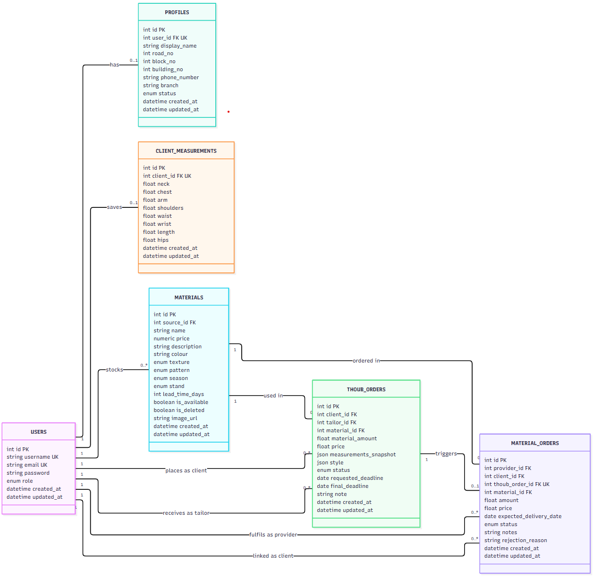
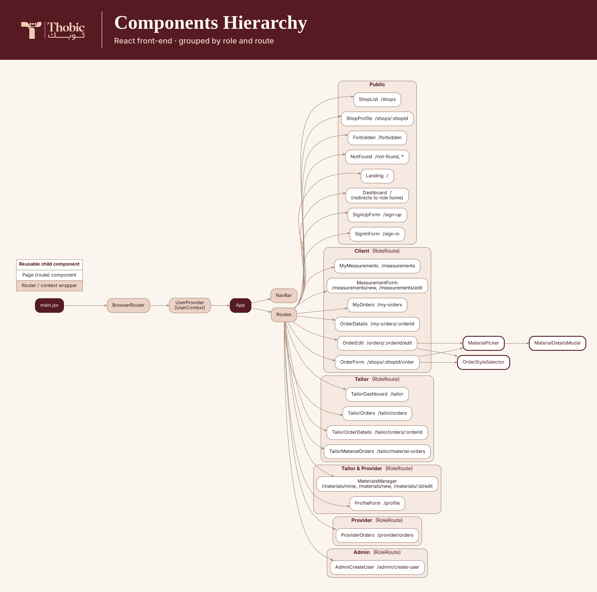

  

<h3 align="center">Thobic</h3>

## Table of Contents

- [Overview](#overview)
- [Core Idea](#core-idea)
- [Repositories](#repositories)
- [Deployment](#deployment)
- [User Stories](#user-stories)
- [ERD](#erd)
- [Route Tables](#route-tables)
- [Wireframes](#wireframes)
- [Components Hierarchy](#components-hierarchy)
- [User Roles](#user-roles)
- [Future Work](#future-work)
- [Technologies Used](#technologies-used)

## Overview

<!-- TODO -->

Thobic is a website where clients design and order a custom thawb from registered tailoring shops.

## Core Idea

<!-- TODO -->

## Repositories

- **Front-end:** [Thobic-Frontend](https://github.com/mo-durazi/Thobic-Frontend)
- **Back-end:** [Thobic-Backend](https://github.com/mo-durazi/Thobic-Backend)

## Deployment

- **Front-end:** <!-- TODO: deployed front-end URL -->
- **Back-end API:** <!-- TODO: deployed back-end URL -->

## User Stories

### Client

- As a client, I want to sign up, sign in and sign out safely and securely.
- As a client, I want to browse tailoring shops and filter them by name, branch and status.
- As a client, I want to create an order and assign it to a specific tailoring shop.
- As a client, I want to select a material from the tailor's in-stock materials for my order.
- As a client, I want to select a material from a provider if I don't like any of the tailor's in-stock materials.
- As a client, I want to browse materials and filter them by texture, pattern, season, stand, colour and price.
- As a client, I want to add my measurements and save them so they are used automatically in my next orders.
- As a client, I want to update my measurements and save the changes.
- As a client, I want to delete my measurements.
- As a client, I want to edit my order details at any time before the tailor accepts it.
- As a client, I want to delete my order before the tailor accepts it.
- As a client, I want to approve or reject my order after the tailor sets the price and final deadline.
- As a client, I want to confirm that my order has been delivered.

### Admin

- As an admin, I want to sign in and sign out safely and securely.
- As an admin, I want to create a tailor account.
- As an admin, I want to create a provider account.

### Tailor

- As a tailor, I want to sign in and sign out safely and securely.
- As a tailor, I want to create and update my shop profile so clients can find my shop.
- As a tailor, I want to view all orders assigned to me and their status.
- As a tailor, I want to view all material orders that have been delivered or will be delivered to me.
- As a tailor, I want to accept or reject the orders that come to me.
- As a tailor, I want to send the client a price and final deadline to confirm when I accept an order.
- As a tailor, I want to update my shop status to open, closed or busy.
- As a tailor, I want to update an order's status from confirmed, to in progress, to ready, to on the way.
- As a tailor, I want to confirm when a provider's material has been delivered to my shop.
- As a tailor, I want to see a summary of the orders assigned to me.
- As a tailor, I want to add my in-stock materials to the system.
- As a tailor, I want to mark my in-stock materials as available or unavailable.

### Provider

- As a provider, I want to sign in and sign out safely and securely.
- As a provider, I want to create and update my profile.
- As a provider, I want to add my in-stock materials to the system.
- As a provider, I want to see all material orders sent to me.
- As a provider, I want to accept a material order with an expected delivery date, or reject it with a reason.
- As a provider, I want to update a material order's status from accepted to on the way.

## ERD

## Route Tables

### Auth (Users)
| Operation | Path | Accessible By | Success | Failure | Description |
|---|---|---|---|---|---|
| POST | /api/register | Public | 201 – user + token | 409 username or email already exists | Register a new client account |
| POST | /api/login | Public | 201 – user + token | 401 invalid username or password | Sign in and receive a JWT |
| GET | /api/current_user | Any signed-in user | 200 – user | 403 invalid/expired token | Get the signed-in user's info |

### Admin
| Operation | Path | Accessible By | Success | Failure | Description |
|---|---|---|---|---|---|
| POST | /api/admin/users | Admin | 201 – created user | 403 not an admin / can't create another admin, 409 username or email already exists | Create a tailor or provider account |

### Profiles
| Operation | Path | Accessible By | Success | Failure | Description |
|---|---|---|---|---|---|
| POST | /api/profiles | Tailor, Provider | 201 – profile | 409 profile already exists | Create the shop/provider profile (name, address, phone, branch, status) |
| GET | /api/profiles/me | Tailor, Provider | 200 – profile | 404 profile not found | Get the signed-in user's profile |
| PUT | /api/profiles/me | Tailor, Provider | 200 – profile | 404 profile not found | Update the profile, including shop status (open / busy / closed) |

### Client Measurements
| Operation | Path | Accessible By | Success | Failure | Description |
|---|---|---|---|---|---|
| POST | /api/measurements | Client | 201 – measurements | 409 measurements already exist | Save the client's measurements |
| GET | /api/measurements/me | Client | 200 – measurements | 404 measurements not found | Get the client's saved measurements |
| PUT | /api/measurements/me | Client | 200 – measurements | 404 measurements not found | Update the client's measurements |
| DELETE | /api/measurements/me | Client | 204 – no content | 404 measurements not found | Delete the client's measurements |

### Materials
| Operation | Path | Accessible By | Success | Failure | Description |
|---|---|---|---|---|---|
| POST | /api/materials/upload-image | Tailor, Provider | 200 – image URL | 400 only image files are allowed | Upload a material image to Cloudinary |
| POST | /api/materials | Tailor, Provider | 201 – material | 422 invalid data | Add a material to the signed-in user's stock |
| GET | /api/materials | Any signed-in user | 200 – list of materials | 400 min_price greater than max_price | Browse available materials. Filters: source_id, source_role, texture, pattern, season, stand, colour, min_price, max_price |
| GET | /api/materials/mine | Tailor, Provider | 200 – list of materials | 403 wrong role | List the signed-in user's own materials |
| GET | /api/materials/{material_id} | Any signed-in user | 200 – material | 404 material not found | Get one material's details |
| PUT | /api/materials/{material_id} | Tailor, Provider (owner) | 200 – material | 404 material not found, 403 not the owner | Update a material, including availability |
| DELETE | /api/materials/{material_id} | Tailor, Provider (owner) | 204 – no content | 404 material not found, 403 not the owner | Soft-delete a material |

### Thoub Orders
| Operation | Path | Accessible By | Success | Failure | Description |
|---|---|---|---|---|---|
| POST | /api/orders | Client | 201 – order | 403 not a client, 400 tailor doesn't exist / no measurements / material unavailable / material not from this shop / deadline in the past | Place a thawb order with a tailor (status: pending) |
| GET | /api/orders/my-orders | Client, Tailor | 200 – list of orders | 403 wrong role | Client sees their orders; tailor sees orders assigned to them |
| GET | /api/orders/{order_id} | Client or tailor on the order, Admin | 200 – order | 404 order not found, 403 access denied | Get one order's details |
| PUT | /api/orders/{order_id} | Client (owner) | 200 – order | 403 not a client, 404 order not found, 409 order is not pending, 400 material unavailable / deadline in the past | Edit an order while it is pending |
| DELETE | /api/orders/{order_id} | Client (owner) | 200 – confirmation | 403 not a client, 404 order not found, 409 order is not pending | Delete an order while it is pending |
| PATCH | /api/orders/{order_id}/tailor-accept | Tailor (assigned) | 200 – order | 403 not a tailor, 404 order not found, 409 order is not pending, 400 price below material cost / final deadline before requested deadline | Tailor sets the price and final deadline (pending → accepted) |
| PATCH | /api/orders/{order_id}/tailor-reject | Tailor (assigned) | 200 – order | 403 not a tailor, 404 order not found, 409 order is not pending | Tailor rejects the order (pending → tailor_rejected) |
| PATCH | /api/orders/{order_id}/client-respond | Client (owner) | 200 – order | 403 not a client, 404 order not found, 409 order is not accepted | Client approves (→ confirmed, creates a material order if the material is from a provider) or declines (→ client_rejected) |
| PATCH | /api/orders/{order_id}/in-progress | Tailor (assigned) | 200 – order | 403 not a tailor, 404 order not found, 409 order not confirmed / provider material not delivered yet | Start work (confirmed → in_progress) |
| PATCH | /api/orders/{order_id}/ready | Tailor (assigned) | 200 – order | 403 not a tailor, 404 order not found, 409 order not in progress | Mark as ready (in_progress → ready) |
| PATCH | /api/orders/{order_id}/on-the-way | Tailor (assigned) | 200 – order | 403 not a tailor, 404 order not found, 409 order not ready | Send for delivery (ready → on_the_way) |
| PATCH | /api/orders/{order_id}/delivered | Client (owner) | 200 – order | 403 not a client, 404 order not found, 409 order not on the way | Client confirms delivery (on_the_way → delivered) |

### Material Orders
| Operation | Path | Accessible By | Success | Failure | Description |
|---|---|---|---|---|---|
| GET | /api/material-orders | Provider, Tailor | 200 – list of material orders | 403 wrong role | Provider sees orders sent to them; tailor sees orders for their thawb orders |
| GET | /api/material-orders/{material_order_id} | Provider or tailor on the order | 200 – material order | 404 material order not found, 403 no permission | Get one material order's details |
| PUT | /api/material-orders/{material_order_id}/accept | Provider (owner) | 200 – material order | 404 not found, 403 not the provider, 409 not pending, 400 delivery date in the past | Accept with an expected delivery date (pending → accepted) |
| PUT | /api/material-orders/{material_order_id}/reject | Provider (owner) | 200 – material order | 404 not found, 403 not the provider, 409 not pending | Reject with a reason (pending → rejected); the linked thawb order is canceled |
| PUT | /api/material-orders/{material_order_id}/on-the-way | Provider (owner) | 200 – material order | 404 not found, 403 not the provider, 409 not accepted | Ship the material (accepted → on_the_way) |
| PUT | /api/material-orders/{material_order_id}/delivered | Tailor (assigned) | 200 – material order | 404 not found, 403 not the tailor, 409 not on the way | Tailor confirms the material arrived (on_the_way → delivered) |

### Shops
| Operation | Path | Accessible By | Success | Failure | Description |
|---|---|---|---|---|---|
| GET | /api/shops | Public | 200 – list of shops | 422 invalid status filter | Browse tailoring shops. Filters: name, branch, status |
| GET | /api/shops/{shop_id} | Public | 200 – shop + available materials | 404 tailoring shop not found | View a shop's profile and its in-stock materials |

## Wireframes

## Components Hierarchy

## User Roles

Thobic has 4 user roles. Clients sign up on their own. Tailor and provider accounts are created by the admin. The admin account is created by the seed script.

| Role | Description | Permissions |
|---|---|---|
| Client | A customer who designs and orders a custom thawb | Sign up, sign in and sign out · Browse and filter tailoring shops · Browse and filter materials from the tailor or from providers · Add, update and delete their measurements · Place an order with a tailor · Edit or delete an order while it is pending · Approve or reject the tailor's price and final deadline · Confirm delivery |
| Tailor | A registered tailoring shop that makes the thawb | Sign in and sign out · Create and update their shop profile · Set shop status (open, busy, closed) · View an order summary on their dashboard · View assigned orders · Accept an order with a price and final deadline, or reject it · Move an order to in progress, ready and on the way · Track material orders and confirm material delivery · Add, edit, delete and toggle availability of their materials |
| Provider | A material supplier that sells fabric to tailors | Sign in and sign out · Create and update their profile · Add, edit, delete and toggle availability of their materials · View material orders sent to them · Accept a material order with an expected delivery date, or reject it with a reason · Mark a material order as on the way |
| Admin | Manages the platform's accounts | Sign in and sign out · Create tailor accounts · Create provider accounts |

### Home page after sign-in

- Client → /shops
- Tailor → /tailor (dashboard)
- Provider → /provider/orders
- Admin → /admin/create-user

## Future Work

<!-- TODO -->

-

## Technologies Used

### Front-end
- **React 19** – UI library
- **Vite** – dev server and build tool
- **React Router** – client-side routing and role-protected routes
- **Axios** and the **Fetch API** – HTTP requests to the back-end
- **Context API** – global user/auth state
- **JWT** – token stored in localStorage and decoded on the client
- **CSS** – custom styling
- **ESLint** – code linting

### Back-end
- **Python 3.14**
- **FastAPI** – REST API framework
- **Uvicorn** – ASGI server
- **SQLAlchemy** – ORM
- **Alembic** – database migrations
- **Pydantic** – request/response validation
- **PyJWT** – JWT authentication
- **Passlib + bcrypt** – password hashing
- **python-multipart** – image upload handling
- **python-dotenv** – environment variables
- **Pytest + HTTPX** – testing
- **Pipenv** – dependency management

### Database
- **PostgreSQL**
- **psycopg2** – PostgreSQL driver for Python

### Tools
- **Cloudinary** – material image hosting
- **Git & GitHub** – version control and collaboration
- **Notion** – project documentation
- **Excalidraw** – wireframes
- **Mermaid** – ERD and diagrams
- **Swagger** – API testing
- **VS Code** – code editor
